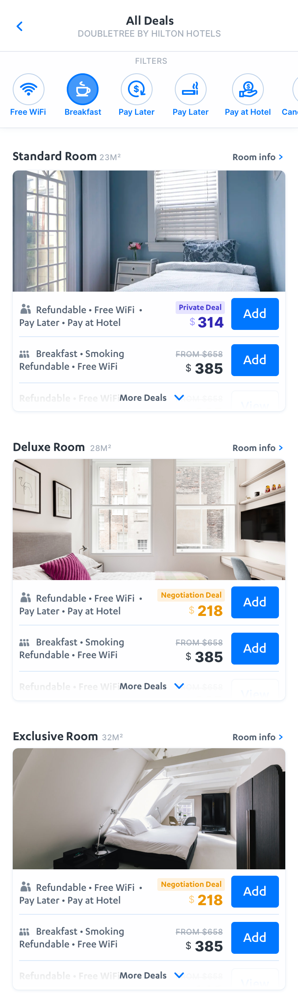
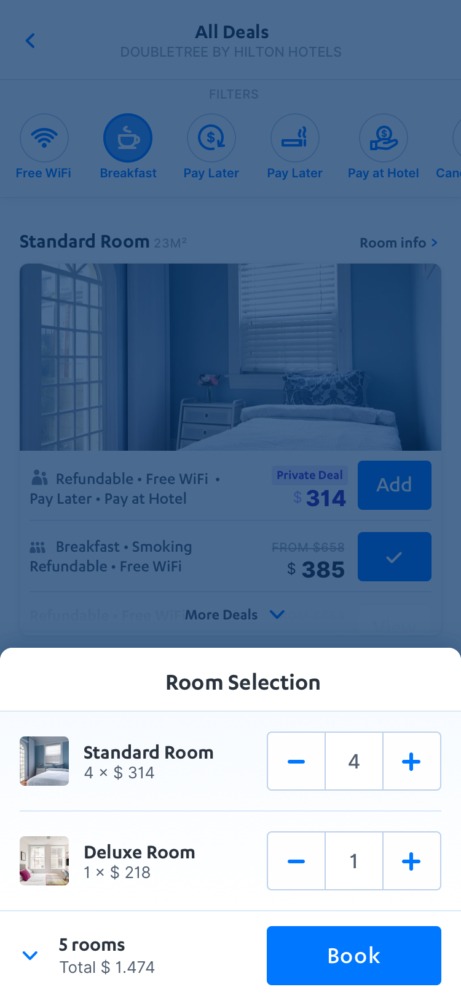

# FindHotel Front-end Engineer Assignment

Thanks for applying for the Front-end Engineer position at FindHotel!

This coding challenge will serve as the first step in the hiring process, the goal is to show case how you work and if it is decided to proceed with the process, will be the starting point of our technical interview.

There are two parts to the challenge, the first is developing the visual components of a supplied design. The second part is about how you implement, test and explain business logic.

## Time to spend on the assignment

We don't assign a fixed time deadline for it, but after you’ve read the assignment, please let us know when you’re planning to complete it. After you complete the assignment we'll review it internally and if we evaluate it to be positive, we'll schedule a technical interview to discuss the results together. As said, feel free to make some concessions under time pressure, just let us know what parts you've focused on most.

## Technology and Frameworks

This project is based on React as that is what we use here at FindHotel, however this is not a hard requirement. If you prefer to use another technology, feel free to set up the assignment with your tools of choice.

We use Redux at FindHotel, but again you're free to choose any information management technology you'd like.

Finally, we prefer to use a typed dialect such as TypeScript or Flow, so it is a plus for you to showcase the use of it, but you are allowed to use any JS flavor.

Styling can be done via CSS, or a CSS-in-JS framework of your choice (we use https://github.com/emotion-js/emotion).

## The assignment

Please note for this assignment you are not required to build any server side logic, you can build all logic in the client-side.
Build the application in a responsive way, so it will adapt to different phone screen sizes.

### Part 1: Building the supplied UI based on the designs

Please see the following screenshots for the designs to build. We provided a sample [JSON file](sample-hotel-data.json) that you can use to render the room cards.

The [Zeplin Project](https://zpl.io/2yN6mZo) can help you with the visual implementation, please request access from the recruiter if you don't have access yet.

Room Selection Screen | Room Basket Overlay
-|-
 | 

#### Provided sample data

A note about the data set provided: feel free to use random images for the hotels, there's no need to include the images from the design (you can download a few from our website if you like).

Some hotel objects contain `meals` (free breakfast), `cancellationPolicy` and `cug` properties. The latter specifies the deal type such as `private` or `negotiation`. The `rateBreakdown` contains split data on prices for the hotels, you can decide to show prices including or excluding taxes based on your preference.

### Part 2: Implementing business logic

In the supplied designs you see there are two pieces of business logic to implement. The first is filtering of rooms based on their properties and price. You can implement this filtering completely on the client side.

The other logic you're required to build is the "room basket" concept. Please keep the following requirements in mind:

* The user can add maximum of 5 rooms of a type to a basket
* In the basket view, when removing the last of a room type, it should remove the room from the basket.
* The room should keep state to show whether it is in a basket or not. Clicking the check mark of an already selected room should remove it from the basket.

It is recommended to write automated tests (unit or integration) to verify and document the business logic.

### Bonus points

* Build a swipeable image gallery in the hotel card.
* Prepare your application to work with different languages (i18n).
* Implement a scaled up version for tablet / desktop devices. Note there is no design supplied, so you'll need to use your imagination if you go this route.
* Use git best practices
