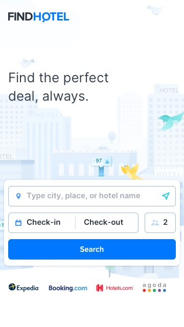
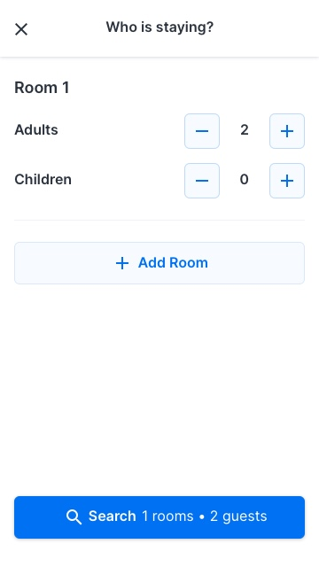
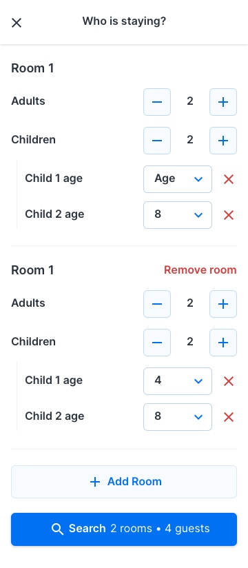

# FindHotel Front-end Engineer Assignment

Thanks for applying for the Front-end Engineer position at FindHotel!

This coding challenge will serve as the first step of technical evaluation in the hiring process, the goal is to show case how you work and if it is decided to proceed with the process, will be the starting point of our technical interview.

There are two parts to the challenge, the first is developing the visual components of a supplied design. The second part is about how you implement, test and explain business logic.

## Time to spend on the assignment

We don't assign a fixed time deadline for it, but after you’ve read the assignment, please let us know when you’re planning to complete it. After you complete the assignment we'll review it internally, and if we evaluate it to be positive, we'll schedule a technical interview to discuss the results together. As said, feel free to make some concessions under time pressure, just let us know what parts you've focused on most.

## Technology and Frameworks

This project is based on React as that is what we use here at FindHotel, however this is not a hard requirement. If you prefer to use another technology, feel free to set up the assignment with your tools of choice.

We use Redux at FindHotel, but again you're free to choose any state management technology you'd like.

Finally, we prefer to use a typed dialect such as TypeScript or Flow, so it is a plus for you to showcase the use of it, but you are allowed to use any JS flavor.

Styling can be done via CSS, or a CSS-in-JS framework of your choice (we use https://github.com/emotion-js/emotion).

## The assignment

Please note for this assignment you are not required to build any server side logic, you can build all logic in the client-side.

### The Guest and Room Selector component

Please see the following screenshots for the designs to build. You can focus on the Guest and Room Selector, **building the home page is not required**.

| Home screen                     | Guest and Room Overlay                                                      | Guest and Room Overlay with more rooms                                                                         |
| ------------------------------- | --------------------------------------------------------------------------- | -------------------------------------------------------------------------------------------------------------- |
|  |  |  |

### Business requirements

#### Input and output

The component should receive its initial state as a string, allow the user to update the state via manipulating the UI, and emit its output as a serialized string.
You should be able to pass the Guests and Rooms configuration in via the URL in this encoded manner. The URL should be updated with this serialized string when the component state is "comitted" (via the `Search` button) to allow for sharing.

The rules for the output format are the following:

- Rooms are separated by pipe `|`
- Adults and children are separated by colon `:`
- Children ages are separated by comma `,`

##### Examples

- "1:4,6|3" → Two rooms, one with one adult and two children ages four and six and the other with three adults and no children
- "3" → One room with three adults and no children
- "2:4" → One room with two adults and one child aged four
- "1:0,13,16" → One room with one adult and three children (aged zero, thirteen and sixteen)

Note: Keep in mind this is the serialized representation of a valid component state, you can keep a different intermediate data structure of your choice to manage internal state.

#### Functional requirements

These are the requirements the component need to abide to be deemed functional.

- Up to eight rooms can be added
- Each room has at least one adult and up to a maximum of five
- Each room has zero or more children up to a maximum of three
- Each child needs to have their age supplied, so we know what kind of bed or cot to provide and what to charge for the room
- Each room has a maximum occupancy of five. This is, adults plus children per room
- The Guest and Room selector should always yield a valid room occupancy, use button disablement to avoid invalid configurations
- A user can either click `Search` to commit the output to the URL, or click the `x` on top to reset the chosen room selection and revert the UI back to the original state.

#### Non Functional requirements

##### Usability

It should be evident to the user how to operate the component. We are here to help the user to understand what are their options and guide them.

##### Configurability

The exact functional requirements of the component can change in the future, aim to make the component configurable for things such as default values and max room occupancy.

##### Testability

It is recommended to write automated tests (unit or integration) to verify and document the business logic.
We leave it up to you to decide which parts of the implementation should be covered by automated tests given the time constraints.

### Evaluation criteria

In general, treat us as your colleagues reviewing your solution, and - as much as you can within the time constraints - try to follow the practices you normally would for having your work reviewed by your peers.

We will evaluate the assignment according to the following aspects:

- Correctness, bug free implementation according to the requirements
- Code quality, how clean, readable, organized and future proof your code is
- Quality assurance, how much confidence your automated tests add to the implementation
- Visual implementation, how close your component implementation is to the supplied designs

Good luck! If you have any questions around the assignment, feel free to reach out :)
